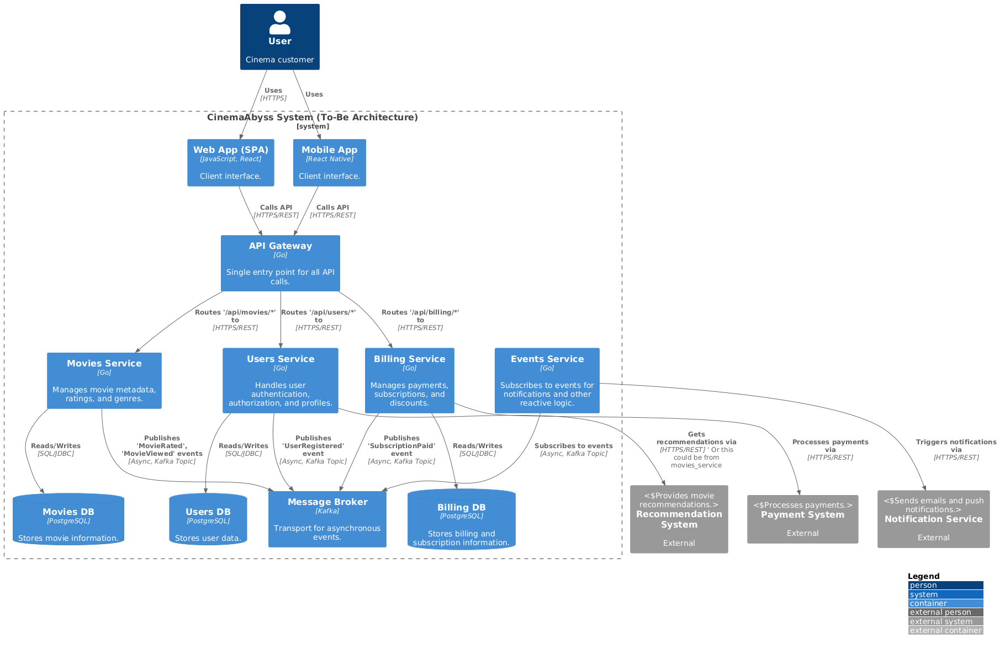

# CinemaAbyss: From Monolith to Microservices

[](https://github.com/agredyaev/architecture-pro-cinemaabyss/actions/workflows/docker-build-push.yml)


This project showcases the complete architectural journey of migrating a monolithic application to a modern, cloud-native microservices architecture.

## Implemented Features & Patterns

-   **Strangler Fig Migration:** A `Proxy` service was developed to intercept traffic, routing `/api/movies` requests to the new `Movies` service while forwarding all other requests to the legacy monolith, enabling a zero-downtime migration.
-   **Event-Driven Core:** An `Events` service and **Apache Kafka** topics were introduced to process `Movie`, `User`, and `Payment` events asynchronously, decoupling services.
-   **Kubernetes Orchestration:** All application components (services, databases, Kafka) are fully containerized with **Docker** and deployed declaratively via Kubernetes manifests.
-   **Helm Release Management:** A comprehensive **Helm chart** was created to manage the entire application stack as a single, versioned, and configurable release, simplifying environment setup and updates.
-   **Automated CI/CD:** A **GitHub Actions** workflow (`docker-build-push.yml`) automatically builds, runs tests, and pushes versioned Docker images to the container registry on every commit to the `main` branch.
-   **Circuit Breaker Resilience:** **Istio** was deployed as a service mesh, and a `DestinationRule` was configured to apply a Circuit Breaker to the `movies-service`. This prevents cascading failures by limiting concurrent connections and ejecting unhealthy pods from the load balancing pool.

## Target Architecture



## Quick Start

All deployment and testing commands are streamlined using the `Makefile`.

### Local Development (Docker Compose)

1.  **Start all services:**
    ```bash
    make up
    ```
2.  **Run API tests:**
    ```bash
    make test
    ```
3.  **Stop all services:**
    ```bash
    make down
    ```

### Kubernetes Deployment (Helm)

1.  **Deploy to Kubernetes:**
    ```bash
    make helm-install
    ```
2.  **Delete from Kubernetes:**
    ```bash
    make helm-delete
    ```

For a detailed breakdown of the tasks and architectural decisions, please refer to the [Project Template](Project_template.md) and [ADRs](docs/adr).