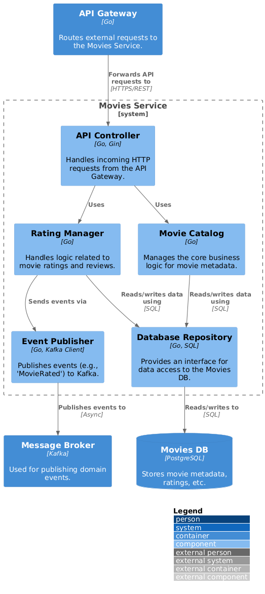

# ADR-001: Первый этап миграции на микросервисную архитектуру

**Дата:** 2025-08-18

**Статус:** Финальная версия

## 1. Контекст

### As-Is Архитектура

Система "Кинобездна" — это монолитное Go-приложение с единой БД PostgreSQL. Вся бизнес-логика сосредоточена в одном приложении, однако можно выделить следующие логические домены с высокой степенью связанности:
*   **Users:** Аутентификация, авторизация, управление профилями.
*   **Movies:** Управление каталогом фильмов, метаданными, жанрами и рейтингами.
*   **Billing:** Обработка платежей, подписок и скидок.

Такая архитектура не отвечает требованиям бизнеса по следующим причинам:
*   **Низкая надежность:** Сбой в одном из доменов (например, в системе платежей) может привести к отказу всей системы.
*   **Сложность масштабирования:** Невозможно масштабировать отдельные части приложения независимо. Например, высокая нагрузка на каталог фильмов требует масштабирования всего монолита, что неэффективно.
*   **Замедление разработки:** Сильная связанность кода приводит к тому, что изменения в одном домене требуют длительного и сложного регрессионного тестирования всего приложения.

### To-Be Архитектура (Этап 1)

Целью данного этапа является выделение из монолита первого микросервиса — **Movies Service**, отвечающего за метаданные фильмов. Это первый шаг в рамках стратегии поэтапного перехода на микросервисы для достижения следующих измеримых целей:
*   **Повышение надежности:** Изолировать домен `Movies` так, чтобы сбои в других частях системы (например, `Billing`) не влияли на возможность пользователей просматривать каталог фильмов.
*   **Улучшение масштабируемости:** Обеспечить возможность независимого масштабирования `Movies Service` для обработки пиковых нагрузок (например, во время выхода популярных новинок) без избыточного масштабирования всей системы.
*   **Ускорение разработки:** Сократить время вывода новых функций, связанных с каталогом фильмов, за счет уменьшения объема регрессионного тестирования.

## 2. Архитектурный подход

### 2.1. Стратегия миграции

Переход осуществляется с использованием паттерна **Strangler Fig** для обеспечения бесшовной миграции без простоя.

1.  **API Gateway:** Весь трафик проходит через `API Gateway`. На первом этапе он проксирует все запросы к монолиту, за исключением тех, что касаются домена `Movies`.
2.  **Выделение Movies Service:** Разработан и развернут микросервис `Movies` со своей собственной базой данных.
3.  **Переключение трафика:** `API Gateway` маршрутизирует все запросы, связанные с фильмами (например, `/api/movies`), на новый `Movies Service`. Остальные запросы (например, `/api/users`, `/api/billing`) продолжают обрабатываться монолитом.

### 2.2. Интеграционное взаимодействие

*   **Синхронное взаимодействие:**
    *   **API Gateway -> Сервисы:** `API Gateway` является единой точкой входа и маршрутизирует запросы.
    *   **Movies Service -> Monolith:** Для получения данных, которые еще не мигрированы (например, информация о подписке пользователя для определения доступа к контенту), `Movies Service` может выполнять прямые синхронные API-вызовы к монолиту. Это временная мера до полного выделения соответствующих доменов.
*   **Асинхронное взаимодействие:**
    *   `Movies Service` публикует события (например, `MovieRated`) в `Message Broker` (Kafka).
    *   `Events Service` подписывается на эти события для выполнения реактивной логики (например, отправки уведомлений через внешние системы).

### 2.3. Стратегия миграции данных и аутентификации

*   **Миграция данных:** Первичная миграция данных о фильмах будет выполнена отдельным batch-процессом. Стратегии синхронизации данных (например, dual-writes) будут спроектированы в отдельном ADR перед реализацией операций записи в `Movies Service`. На данном этапе `API Gateway` не выполняет двойной записи.
*   **Аутентификация:** На данном этапе аутентификация остается в монолите. `API Gateway` делегирует проверку токенов и сессий монолиту. `Movies Service` доверяет запросам, прошедшим через `API Gateway`. Миграция аутентификации в отдельный сервис (`Users Service`) является задачей следующего этапа.

## 3. Визуализация решения (C4)

### Уровень 2: Контейнеры (Этап 1)
*Исходный код: [c2_containers.puml](./../diagrams/c2_containers.puml)*

### Уровень 3: Компоненты сервиса Movies
*Исходный код: [c3_movies_service_components.puml](./../diagrams/c3_movies_service_components.puml)*

## 4. Последствия и риски

*   **Риски и их минимизация:**
    *   **Сложность миграции данных:** Риск рассинхронизации при будущей реализации записи в `Movies Service`. **План:** Посвятить отдельный ADR детальному проектированию стратегии миграции и синхронизации данных перед началом ее реализации.
    *   **Зависимость от монолита:** Новый сервис временно зависит от API монолита. **План:** Стабилизация и документирование API монолита, которое будет использоваться новыми сервисами.
    *   **Сложность отладки:** Трассировка запросов. **План:** Внедрение распределенной трассировки с первого дня.
