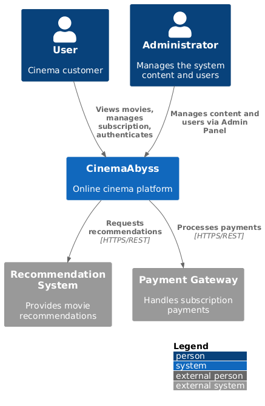

# ADR-001: Целевая микросервисная архитектура

**Дата:** 2025-08-18
**Статус:** Принято

## 1. Контекст

### As-Is Архитектура
Система "Кинобездна" — это монолитное Go-приложение с единой БД PostgreSQL. Логические домены (`Users`, `Movies`, `Billing`) сильно связаны.

**Проблемы:**
*   **Низкая надежность:** Сбой в одном домене приводит к отказу всей системы.
*   **Сложность масштабирования:** Невозможность независимого масштабирования отдельных доменов.
*   **Замедление разработки:** Высокая связанность кода усложняет регрессионное тестирование и замедляет вывод новых функций.

### To-Be Архитектура
Цель — переход к микросервисной архитектуре для повышения надежности, масштабируемости и скорости разработки. Система будет разделена на независимые, слабосвязанные сервисы, соответствующие бизнес-доменам.

## 2. Архитектурное решение

**1. Декомпозиция:**
Монолит будет разделен на следующие сервисы:
*   `Users Service`: Аутентификация (выдача JWT), авторизация, управление профилями.
*   `Movies Service`: Управление каталогом фильмов, метаданными, жанрами и рейтингами.
*   `Billing Service`: Обработка платежей, подписок и скидок.
*   `Events Service`: Обработка асинхронных событий в системе.

**2. Интеграция:**
*   **Синхронное взаимодействие:** `API Gateway` будет единой точкой входа для всех клиентских приложений, выполняя валидацию токенов и маршрутизацию запросов.
*   **Асинхронное взаимодействие:** Для межсервисной коммуникации будет использоваться брокер сообщений `Kafka`. Это позволит сервисам-продюсерам и консьюмерам работать независимо, не зная друг о друге, и обеспечит буферизацию сообщений при недоступности сервиса-получателя.

**3. Данные:**
*   Каждый микросервис будет владеть собственной базой данных для обеспечения полной независимости (Database per Service).

## 3. Визуализация (C4)
### Контекст 
--------

### Целевая архитектура
--------

## 4. Последствия и риски

*   **Сложность эксплуатации:** Минимизируется использованием Kubernetes для оркестрации, а также внедрением централизованного логирования и мониторинга.
*   **Консистентность данных:** Будет обеспечиваться с помощью паттернов, основанных на событиях (например, Saga), для управления распределенными транзакциями.
*   **Сетевые задержки:** Минимизируются за счет продуманного проектирования API и использования асинхронных взаимодействий, где это применимо.