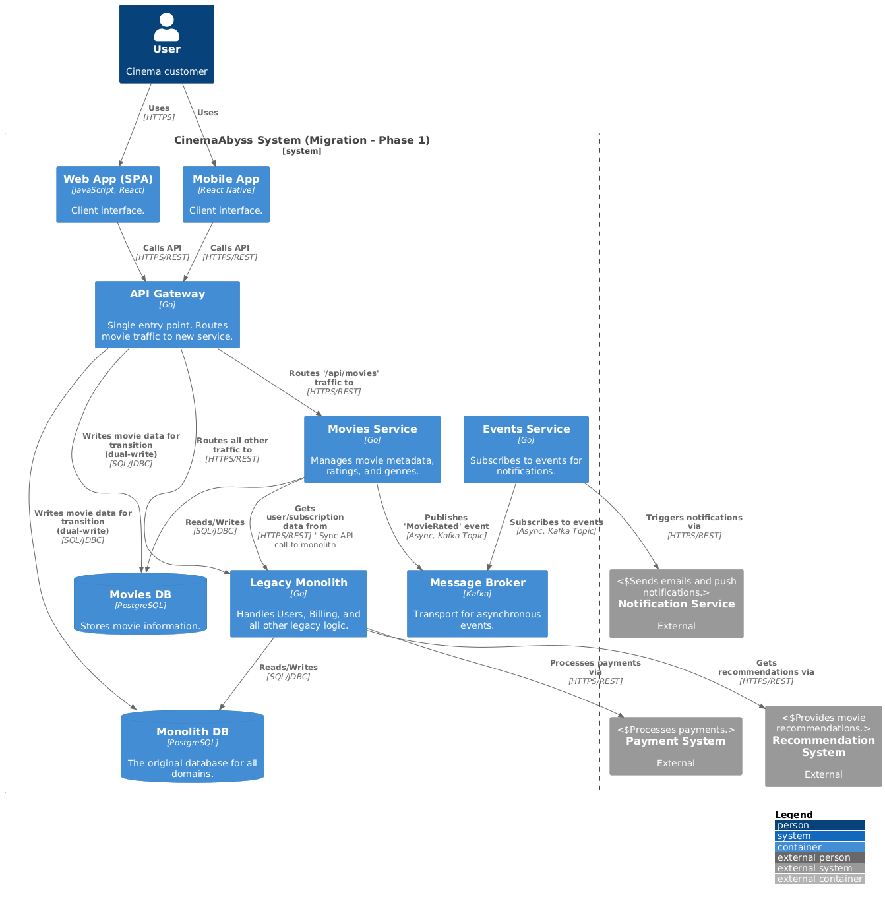

# ADR-002: Этап 1. Гибридная архитектура

**Дата:** 2025-08-18
**Статус:** Принято

## 1. Контекст

Этот документ описывает первый практический шаг по переходу от монолитной архитектуры к целевой, описанной в [ADR-001](./001-target-microservice-architecture.md).

Цель — выделить из монолита `Movies Service` для немедленного получения выгод в виде независимого масштабирования и развертывания этого домена.

## 2. Архитектурное решение

**1. Стратегия миграции (Strangler Fig Pattern):**
*   `API Gateway` будет проксировать весь входящий трафик.
*   Запросы, относящиеся к домену `Movies` (например, `/api/movies`), будут маршрутизироваться на новый `Movies Service`.
*   Все остальные запросы продолжат обрабатываться существующим монолитом.

**2. Интеграция в гибридном режиме:**
*   **Синхронное взаимодействие:** `Movies Service` может синхронно обращаться к API монолита для получения данных из еще не мигрировавших доменов (например, данных о подписке пользователя). Это временная зависимость.
*   **Асинхронное взаимодействие:** `Movies Service` будет публиковать доменные события (например, `MovieRated`) в `Kafka`. `Events Service` будет их потреблять для реализации реактивной логики.

**3. Данные и аутентификация:**
*   **Данные:** `Movies Service` будет использовать собственную базу данных. Первичная миграция данных будет выполнена batch-процессом.
*   **Аутентификация:** На этом этапе остается в монолите. `API Gateway` делегирует проверку токенов монолиту.

## 3. Визуализация (C4)

*Исходный код: [c2_containers.puml](./../diagrams/c2_containers.puml)*

## 4. Последствия и риски

*   **Зависимость от монолита:** Временная зависимость `Movies Service` от API монолита. **Минимизация:** Стабилизация и документирование соответствующей части API монолита.
*   **Сложность отладки:** Трассировка запросов между `API Gateway`, новым сервисом и монолитом. **Минимизация:** Внедрение распределенной трассировки (например, с помощью OpenTelemetry) с первого этапа.